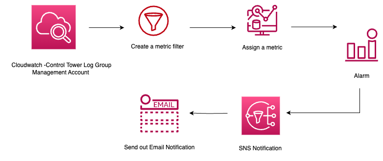

# Securing Root Access in AWS Control Tower "Deny, Monitor, Alert"

Control Tower provides a well-architected, multi-account AWS environment based on security and compliance best practices. Therefore, it's crucial to safeguard and closely watch over root access.

This solution utilizes Control Tower's built-in controls to limit root user activities within member accounts. 

It enables the following set of strongly recommended controls specifically targeted at securing root access.
- [AWS-GR_RESTRICT_ROOT_USER](https://docs.aws.amazon.com/controltower/latest/userguide/control-metadata-tables.html#AWS-GR_RESTRICT_ROOT_USER)
- [AWS-GR_RESTRICT_ROOT_USER_ACCESS_KEYS](https://docs.aws.amazon.com/controltower/latest/userguide/control-metadata-tables.html#AWS-GR_RESTRICT_ROOT_USER_ACCESS_KEYS)

While these controls are not natively applicable to the management account, this approach streamlines the creation of alerts designed to supervise root access. These alerts will promptly trigger email notifications in response to any detected root activity.

# Architecture for alerts 

# Usage

- Clone the repo 
- Edit the configuration 
    - Provide the email addresses where email notification should go for management accounts's root activty 
    - Provide the OU where the you want to enable the above controls
- Deploy in the management account (terrform plan, terraform apply)
